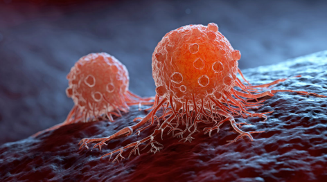
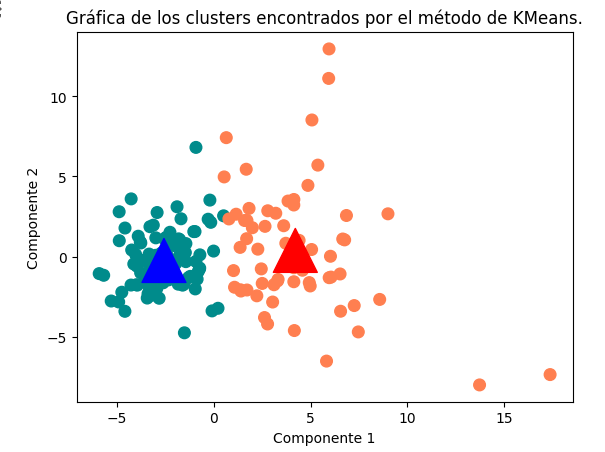
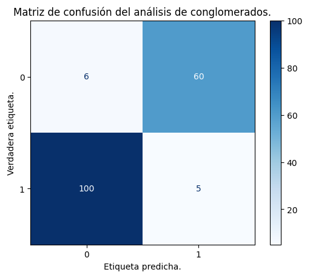

<h1 align="center">Multivariate-statistics-for-obtaining-cancer-type-characteristics</h1>

## Author 
- [Ashley Dafne Aguilar Salinas - UNAM ENES Morelia](https://github.com/AshleyDafneAguilar)
- [Mario Alberto Martinez - UNAM ENES Morelia](https://github.com/mariomttz)

## Introduction 
Cancer is a disease in which some cells in the body multiply uncontrollably and spread to other parts of the body.
Sometimes the process does not follow this order and abnormal or damaged cells form and multiply when they shouldn't. These cells may form tumors, which are lumps of tissue. Tumors are either cancerous (malignant) or noncancerous (benign) [National Cancer Institute](https://www.cancer.gov/espanol/cancer/naturaleza/que-es)[n.d.]
Malignant masses often spread or invade nearby tissues, and may also spread to other parts of the body through the blood and lymphatic system. 
Whereas benign masses sometimes grow very large but do not spread and also do not invade nearby tissues or other parts of the body [NCI[n.d.]]

The following work aims to perform a statistical analysis of the data set called [Cancer Data.](https://www.kaggle.com/datasets/erdemtaha/cancer-data?rvi=1)
The techniques to be applied to perform the analysis will be multiple linear regression (MLRA), principal component analysis (PCA), factor analysis (FA) and cluster analysis. In addition, the necessary preprocessing for data cleaning will be carried out.

## Conclusions
We saw how dimensionality reduction minimizes the costs of machine learning in KMeans and allows the resolution of complex problems with simple models by visualizing the data in 2D dimension graphs. 

*Note that 0 refers to Malignant Cancer, while 1 is Benign Cancer.*

This technique allows to reduce the model training time, but it also has some drawbacks such as the loss of some data.

As for our results, we can see that we obtained good models.This is due to the value of the model evaluation metrics or the amount of variance explained by the new principal components or factors.

**Note:**
*The bar charts, scatter plots, heat maps, confusion matrices, etc. from this project are located in the img folder. 
The file report.pdf contains a summary of the work done.*

## References
- [n. d.]. Diccionario de cáncer del NCI. https://www.cancer.gov/espanol/publicaciones/diccionarios/diccionario-cancer/def/tumor
- Instituto Nacional de Cáncer. [n. d.]. ¿Qué es el cáncer? https://www.cancer.gov/espanol/cancer/naturaleza/que-es
